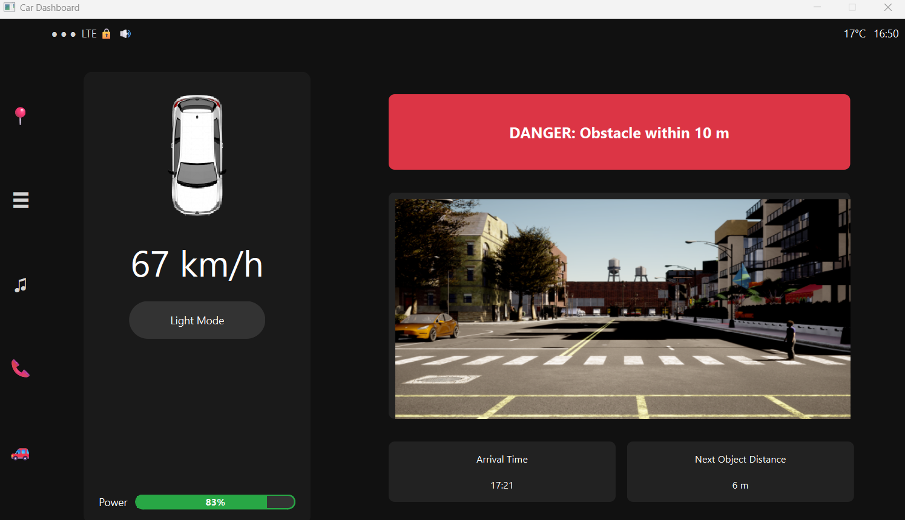

# Documentation of Submission of Julian and Ali

```bash
project_root/
│
├── data/
│   ├── input/         # Per-scene input metadata (JSON)
│   ├── output/        # Per-scene ground-truth labels (JSON)
│   └── predictions/   # Model predictions (JSON)
│
├── models/
│   └── dummy_model.py         # DummyModel class for testing
│
├── utils/
│   ├── box_utils.py           # 3D box utilities (create_3d_box, compute_3d_iou, etc.)
│   └── json_utils.py          # JSON load/save utilities
│
├── assets/
│   └── car_top_view.png       # Image asset for dashboard (used by frontend.py)
│
├── detect_objects.py          # Runs YOLO model for object detection
├── frontend.py                # PyQt6 dashboard GUI
├── test.py                    # Main pipeline: sensor fusion, prediction, evaluation, visualization
├── visualize_scene.py         # Standalone visualization and IoU calculation script
│
├── README.md                 

```


# Fusion_event


## 🔍 Problem

Autonomous vehicles rely on sensors like LiDAR and cameras to perceive their environment. Each sensor has strengths and limitations:

🔹 LiDAR provides accurate 3D data but lacks color information.

🔹 Cameras capture rich visuals but are sensitive to lighting conditions.


Individually, these sensors can be noisy or miss key details due to occlusions from other road agents. However, by fusing data from multiple sensors and vehicles, we can create a more reliable, comprehensive view of the scene, improving safety and awareness.

## 🚦 Scenario

Two self-driving cars are approaching an intersection, each equipped with:


✅ 3D LiDAR

✅ Camera

The environment includes vehicles, pedestrians, and cyclists, some of whom may block each vehicle’s view. By communicating and sharing sensor data, the vehicles can collaborate to overcome occlusions and enhance situational understanding.


The camera Intrinsic Matrix is
``` 
  2058.72664   ,  0           , 960
  0            , 2058.72664   , 540
  0            , 0            , 1
```

Each lidar is mounted above the center of its vehicle by 1.7 meters. The camera, as well, is mounted 1.5 meters above the center. Both are directed towards the front of the car, parallel to the road level.

## Dataset Description

The [/data/input](/data/input) folder contains a JSON metadata file for each scene. Each JSON file contains the following information

| Field | Description | Unit |
| --- | --- | --- |
| CarA_Camera | Path to the image captured by the first vehicle's camera |  |
| CarA_Lidar | Path to the point cloud captured by the first vehicle's Lidar|  |
| CarA_Location | The location of the center of the first vehicle (x, y) | meters |
| CarA_Rotation | The rotation of the first vehicle | degree |
| CarA_Dimension | The dimensions of the first vehicle (Length, Width, Height) | m |
| CarB_Camera | Path to the image captured by the second vehicle's camera |  |
| CarB_Lidar | Path to the point cloud captured by the second vehicle's Lidar|  |
| CarB_Location | The location of the center of the second vehicle (x, y) | meters |
| CarB_Rotation | The rotation of the second vehicle | degree |
| CarB_Dimension | The dimensions of the second vehicle (Length, Width, Height) | meters |

The [/data/output](/data/output) folder contains JSON files of all other road agents in the scene. Each JSON file contains an array of 

| Field | Description | Unit |
| --- | --- | --- |
| Object | the type of road agents (Car/Pedestrian) |  |
| Location | The location of the center of the road agent (x, y) | meters |
| Rotation | The rotation of the road agent | degree |
| Dimension | The dimensions of the road agent (Length, Width, Height) | meters |

  ## 🎯 Goal

Process the raw camera and LiDAR data from both vehicles to:


🔹 Generate individual object detection outputs for each car.

🔹 Fuse the data to build a shared perception of the scene.

🔹 Enhance visibility by addressing sensor occlusions and inconsistencies.

🔹 Output a visual representation showing detected agents from both perspectives.

## 🔍 GUI & Frontend what tech is used

(Dummy text regarding the GUI)

🔹 LiDAR provides accurate 3D data but lacks color information.

🔹 Cameras capture rich visuals but are sensitive to lighting conditions.

## 🔍 GUI & Frontend

The dashboard interface is built using **PyQt6** for a modern, responsive car dashboard look.

### ⚙️ Tech Stack

- **Language:** Python 3
- **GUI Framework:** [PyQt6](https://pypi.org/project/PyQt6/)
- **Image Handling:** Qt (QPixmap), OpenCV
- **Assets:** All UI graphics (like the top-view car) are loaded from the `assets/` folder

### 🖥️ Features

- **Live speed, arrival time, and power display** — values update dynamically, simulating a real car dashboard.
- **Obstacle detection alert** — shows real-time warnings like `"DANGER: Obstacle within 10m"` in a bold red card if any object is too close.
- **Image slideshow** — cycles through camera images from the dataset (from `data/CameraA/`), showing the car’s current view.
- **Theme toggle** — switch between dark and light modes with a single button.
- **Modern styling** — custom fonts, color-coded status, sidebar icons for navigation, and responsive layout.

### 🏗️ Folder Structure

- `frontend.py` — main application file (run this to start the dashboard)
- `assets/` — UI images (e.g. `car_top_view.png`)
- `data/CameraA/` — slideshow camera images shown in the interface

## 📸 Output Example: Sensor Fusion Visualization

This example shows the output of our perception pipeline, fusing LiDAR and camera data to detect obstacles and visualize the scene:


